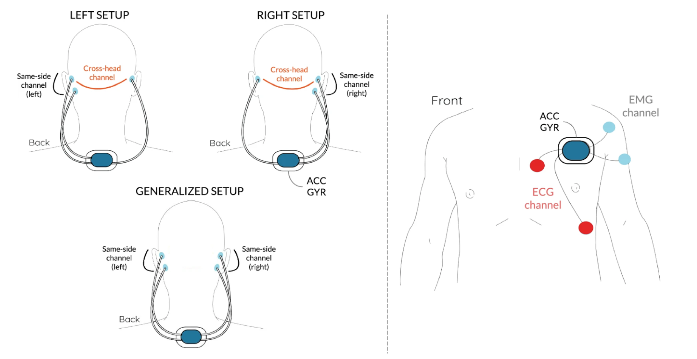
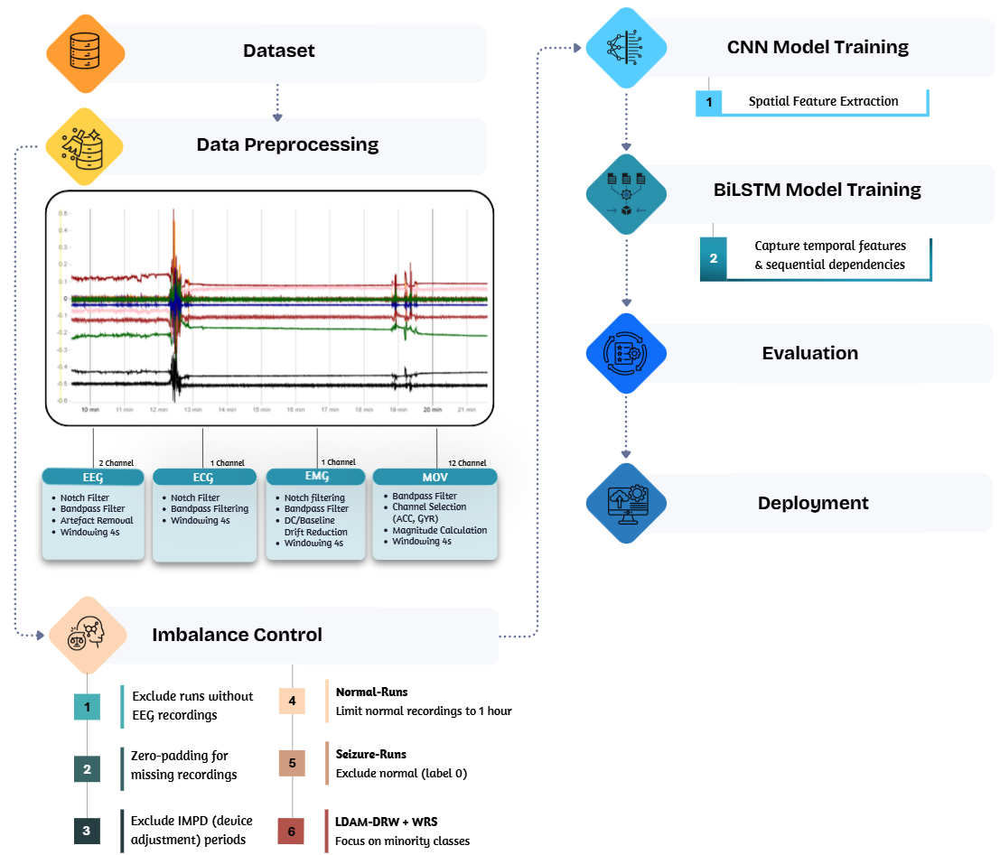
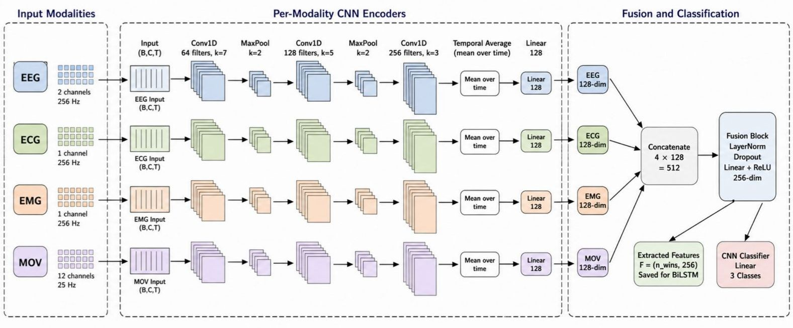
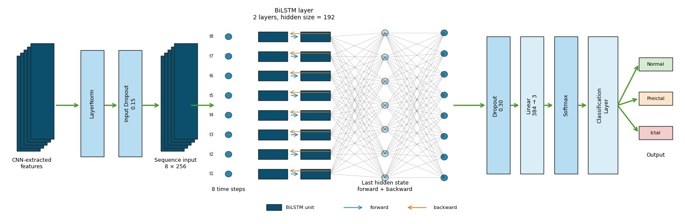

# 🧠 MindWatch: Multimodal Physiological Signal Fusion for Drug-Resistant Epilepsy Prediction Using Deep Learning

Deep learning-based multimodal seizure prediction framework using EEG, ECG, EMG, and motion signals collected from wearable monitoring systems. The project focuses on improving seizure prediction performance using deep learning techniques for spatial and temporal physiological pattern learning.

---

## 🔗 Demo

[Open Project Demo](https://mindwatch-main-neon.vercel.app/)

---

# 📡 Sensors and Physiological Signals

The framework integrates multiple physiological modalities acquired from wearable systems:

- EEG (Electroencephalography)
- ECG (Electrocardiography)
- EMG (Electromyography)
- Motion Signals

  

---

# ⚙️ Proposed Methodology

The proposed pipeline includes preprocessing, imbalance handling, deep feature extraction, temporal modeling, and evaluation stages.

  

---

# 🧩 Deep Learning Architecture

## CNN-Based Spatial Feature Extraction

CNN models were utilized to automatically learn spatial representations and hidden physiological patterns from multimodal signals.

  

---

## BiLSTM Temporal Modeling

BiLSTM networks were used to capture temporal dependencies and seizure-related sequential patterns across time windows.

  

---

# ⚖️ Class Imbalance Control

To improve seizure-state learning and reduce model bias, imbalance handling was applied at two complementary levels.

## 📊 Data-Level Imbalance Control

Several preprocessing strategies were implemented, including:

- Excluding recordings without valid EEG signals
- Limiting normal recordings
- Removing IMPD/device adjustment periods
- Retaining seizure-related runs
- Zero-padding missing modalities

These steps improved minority-class representation and enhanced data consistency across modalities.

---

## 🧠 Model-Level Imbalance Control

Multiple imbalance-aware learning strategies were evaluated:

- Weighted Cross-Entropy (WCE)
- Focal Loss
- LDAM
- LDAM-DRW + Weighted Random Sampling (WRS)

### Experimental Notebooks

- `BiLSTM5+6_WCE + Focal.IPYNB`
- `BiLSTM7_LDAM.IPYNB`
- `BiLSTM1_LDAM-DRW + WRS.IPYNB`
- `BiLSTM2_LDAM-DRW + WRS.IPYNB`
- `BiLSTM3_LDAM-DRW + WRS.IPYNB`
- `BiLSTM4_LDAM-DRW + WRS.IPYNB`

The best overall performance was achieved using **LDAM-DRW combined with Weighted Random Sampling (WRS)**.

---

# 📈 Experimental Configurations

Multiple BiLSTM configurations were tested to optimize temporal modeling performance.

| Configuration | Balanced Accuracy | Macro F1-score | FPR (Pre-ictal) |
|---|---|---|---|
| Configuration 1 | 0.9762 | 0.8775 | 0.0386 |
| Configuration 2 | 0.9776 | 0.8798 | 0.0357 |
| Configuration 3 | 0.9774 | 0.8751 | 0.0366 |
| ⭐ Configuration 4 | **0.9799** | **0.8970** | **0.0323** |

Configuration 4 achieved the best overall performance among all evaluated settings.

---

# 📂 Repository Contents

| File / Folder | Description |
|---|---|
| `PREPROCESS.IPYNB` | Signal preprocessing pipeline |
| `HandCraft_AllModalities.IPYNB` | Handcrafted feature extraction |
| `CNN_AllModalities.IPYNB` | Multimodal CNN experiments |
| `CNN_EEGonly.IPYNB` | EEG-only experiments |
| `BiLSTM*_Result` | BiLSTM training and evaluation results |
| `CNN_Result` | CNN model outputs |
| `Image` | Project figures and methodology illustrations |

---

# 🛠️ Technologies Used

- Python
- PyTorch
- NumPy
- Pandas
- Scikit-learn
- MNE

---

# 🎯 Project Goal

Developing a robust multimodal seizure prediction framework capable of improving seizure-state detection while reducing false alarms for potential real-world healthcare applications.
